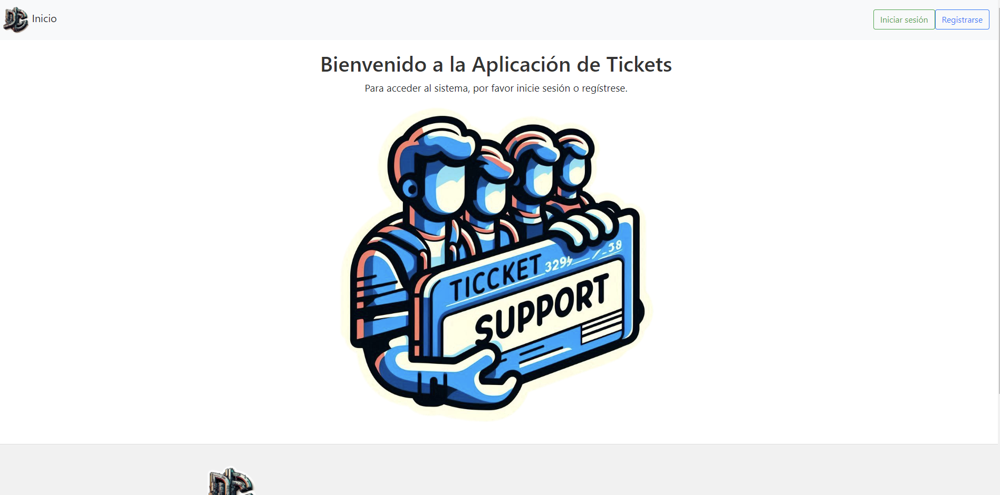
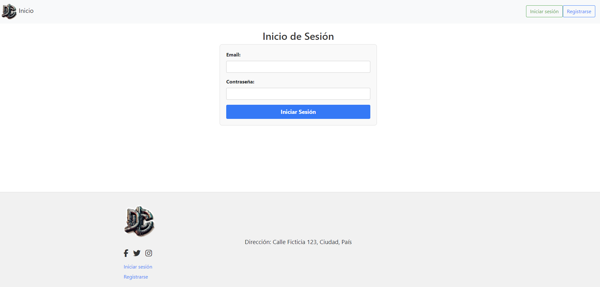
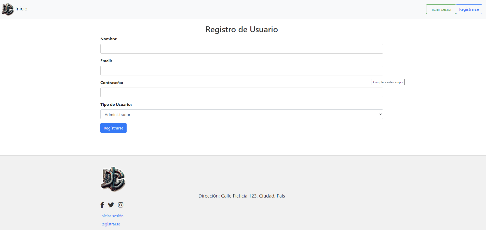
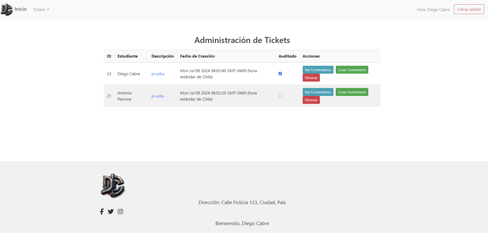
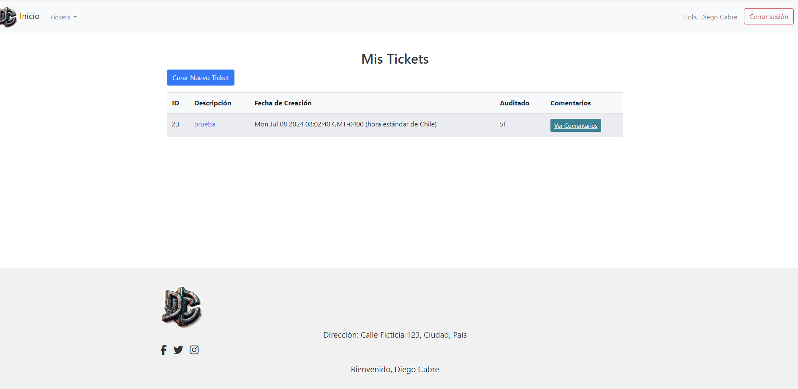
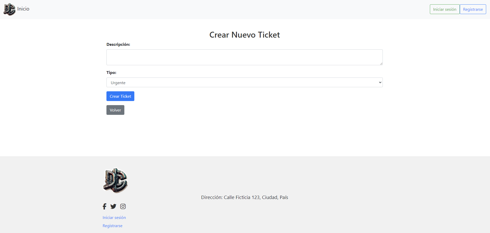
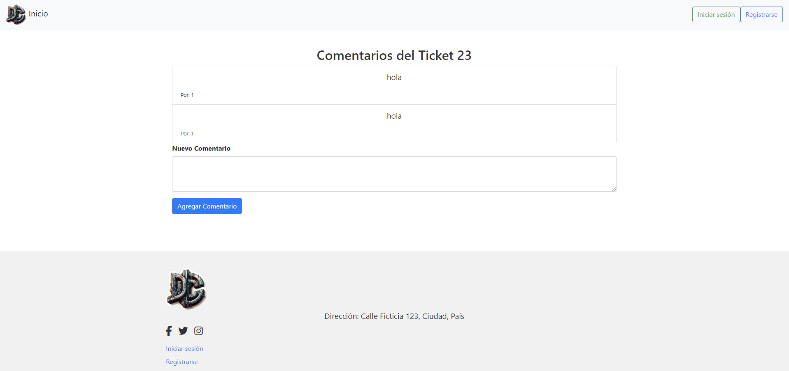

# Título del Proyecto

Sistema de Tickets para Soporte Técnico.

## Descripción del Proyecto

Este proyecto es un sistema de tickets para soporte técnico que permite a los usuarios crear, visualizar y gestionar tickets de soporte. Incluye funcionalidades para diferentes tipos de usuarios, tales como administradores y estudiantes. Los administradores pueden ver todos los tickets, auditarlos y añadir comentarios, mientras que los estudiantes pueden crear nuevos tickets y ver los comentarios asociados a los mismos.

## Capturas de Pantalla del Proyecto









## Prerrequisitos o Dependencias

### Dependencias

- `bcryptjs`: "^2.4.3"
- `body-parser`: "^1.20.2"
- `dotenv`: "^16.4.5"
- `express`: "^4.19.2"
- `express-handlebars`: "^7.1.3"
- `express-session`: "^1.18.0"
- `jsonwebtoken`: "^9.0.2"
- `method-override`: "^3.0.0"
- `pg`: "^8.12.0"

### DevDependencies

- `nodemon`: "^3.1.4"

## Instalación del Proyecto

Sigue los siguientes pasos para configurar el entorno de desarrollo e instalar todas las dependencias necesarias.

```bash
# Paso 1: Clona el repositorio
git clone https://https://github.com/diegocabre/Gestion-Tickets

# Paso 2: Navega al directorio del proyecto
cd Gestion-Tickets


# Paso 3: Instala las dependencias
npm install

Credenciales de Acceso
Para Usuario Tipo Administrador
Email: administrador@mail.com
Contraseña: Abc123#
Para Usuario Tipo Estudiante
Email: estudiante@mail.com
Contraseña: Abc123#
Email: estudiante2@mail.com
Contraseña: Abc123#
Autor

Diego Cabre
```
